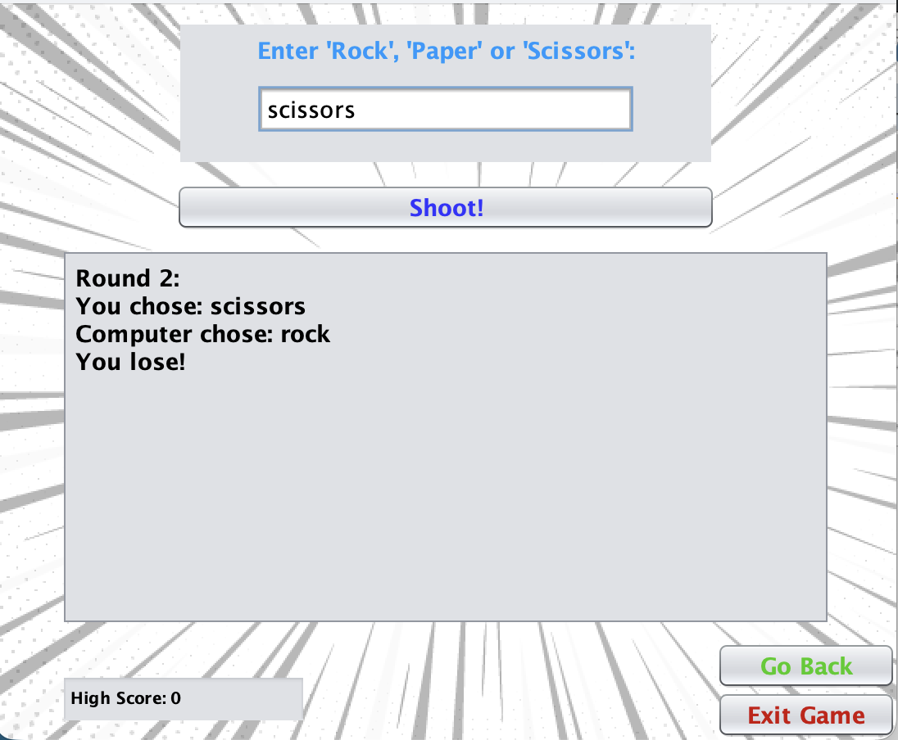

# Rock Paper Scissors

A best-of-5 Rock Paper Scissors game with a timed score and a saved high score, built with Java Swing.

## About

Made for an online class in high school as a final project to demonstrate what we learned in Java.

Originally written in June 2024 and uploaded to GitHub in 2026. Changes made since then are in the commit history.

## Features

- Five rounds against the computer (ties are replayed)
- Score based on wins and speed
- High score saved between sessions in a text file
- Input validation for empty or invalid entries

## How to run

Requires Java 8 or newer and Apache NetBeans (built and tested with JDK 25).

1. Clone the repo: `git clone https://github.com/YOUR-USERNAME/rock-paper-scissors.git`
2. In NetBeans, choose File → Open Project and select the cloned folder.
3. Run the project (F6).

## How to play

Type `rock`, `paper`, or `scissors` and press **Shoot!**. Play five rounds and try to beat your high score.

## Ideas for improvement

- Add functionality for enter key on choices text box.

## Author

Jesse Jones
